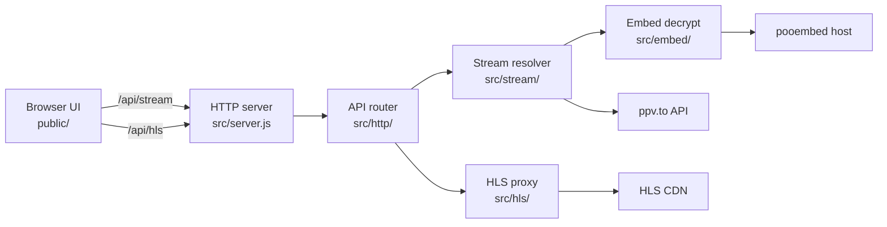

# ppv-stream-resolver

Self-hosted Node.js **HLS stream resolver** and **m3u8 proxy** for [ppv.to](https://ppv.to) live pages. Paste a live stream URL, resolve it to a direct **M3U8 playlist** through a local **REST API**, run **WebAssembly embed decryption**, rewrite manifests for browser playback, and watch through a built-in **HTTP server** web UI.

## How the stream resolver works

- Parses ppv.to live page URLs into stream slugs (`/live/…`, `24/7` channels normalized to `247-…`)
- Fetches stream metadata from the ppv.to API and selects the default iframe embed source
- Posts to the pooembed host, loads the player WASM module in a happy-dom sandbox, and extracts the secure `index.m3u8` URL
- Returns a proxied playback link that loops HLS manifests and MPEG-TS segments through `/api/hls`
- Rewrites playlist URIs, strips PNG-wrapped transport stream payloads, and blocks poisoned upstream playlists
- Serves a minimal browser UI with hls.js live playback and proxied URL copy

## Quick start

```bash
npm install
npm start
```

Open `http://127.0.0.1:8788`, copy a live page URL from [ppv.to](https://ppv.to), paste it, and click **Resolve**.

Requires Node.js 18+ (native `fetch`). Runs as a local **HTTP server** on port `8788` by default (`PORT` and `HOST` env overrides).

## Architecture



### Resolve flow

1. **Parse URL** — `src/stream/resolve.js` accepts a full ppv.to URL, path, or slug and normalizes it to a stream URI
2. **Stream metadata** — `GET api.ppv.to/api/streams/{uri}` returns available embed sources
3. **Embed fetch** — `src/embed/decrypt.js` posts the embed path to pooembed and reads the `island` response header
4. **WASM decrypt** — the bundled gasm WASM module runs inside happy-dom with a mocked JW Player surface and yields the secure m3u8 URL
5. **Proxied link** — `{origin}/api/hls?url=…&embed=…` is returned for browser-safe live streaming playback

### HLS proxy flow

1. Upstream m3u8 or segment is fetched with embed referer headers through impit
2. Master and media playlists are rewritten so segment URLs route back through `/api/hls`
3. Live media playlists hold back the newest segment to reduce player stall on edge manifests
4. PNG-wrapped MPEG-TS payloads are stripped before segments are returned to the client

## Project layout

```
src/
  server.js           HTTP entry, binds host and port
  config.js           ppv.to API base, embed origin, user-agent
  http/router.js      static UI, POST /api/stream, GET /api/hls
  stream/resolve.js   URL parse, metadata fetch, resolve orchestration
  hls/proxy.js        playlist rewrite, segment proxy, TS strip
  embed/
    decrypt.js        pooembed fetch, WASM decrypt, m3u8 extraction
    upstream.js       upstream fetch client with embed headers
    media.js          playlist sniffing, poison detection, proxy rules
    wasm/             bundled player WASM assets
public/
  index.html          resolve UI, hls.js player, proxied URL copy
```

## Streaming API

### `POST /api/stream`

Resolves a ppv.to live page URL to a direct HLS playlist and a local proxied playback link.

**Body**

```json
{ "url": "https://ppv.to/live/your-stream" }
```

Also accepts `contentPath`, `path`, or `uri` instead of `url`.

**Success response**

```json
{
  "ok": true,
  "uri": "your-stream",
  "contentPath": "/live/your-stream",
  "embedPath": "your-stream",
  "streamUrl": "https://cdn.example/secure/…/index.m3u8",
  "proxiedUrl": "http://127.0.0.1:8788/api/hls?url=…&embed=…"
}
```

**Error response**

```json
{
  "ok": false,
  "stage": "decrypt",
  "error": "decrypt did not produce m3u8 url",
  "uri": "your-stream",
  "contentPath": "/live/your-stream",
  "embedPath": "your-stream"
}
```

Stages: `input`, `meta`, `source`, `decrypt`.

### `GET /api/hls`

HLS proxy endpoint for m3u8 manifests and MPEG-TS segments.

| Param | Required | Description |
| --- | --- | --- |
| `url` | yes | Upstream m3u8 or segment URL |
| `embed` | no | Embed path used for upstream referer headers |

Returns a rewritten m3u8 manifest or MPEG-TS segment bytes with CORS headers.

## Stream URL format

Live ppv.to page URLs and equivalent path slugs are supported.

```
https://ppv.to/live/{slug}
https://ppv.to/live/247-{channel}
```

Path-only input also works:

```
/live/{slug}
{slug}
```

The resolver strips a leading `live/` prefix and normalizes `24/7-` slugs to `247-`.

## Stack

- Node.js ES modules, `node:http`, native `fetch`
- happy-dom for WASM player sandboxing
- impit for upstream HLS fetches with browser-like headers
- hls.js 1.5.20 (CDN) for in-browser live streaming playback
